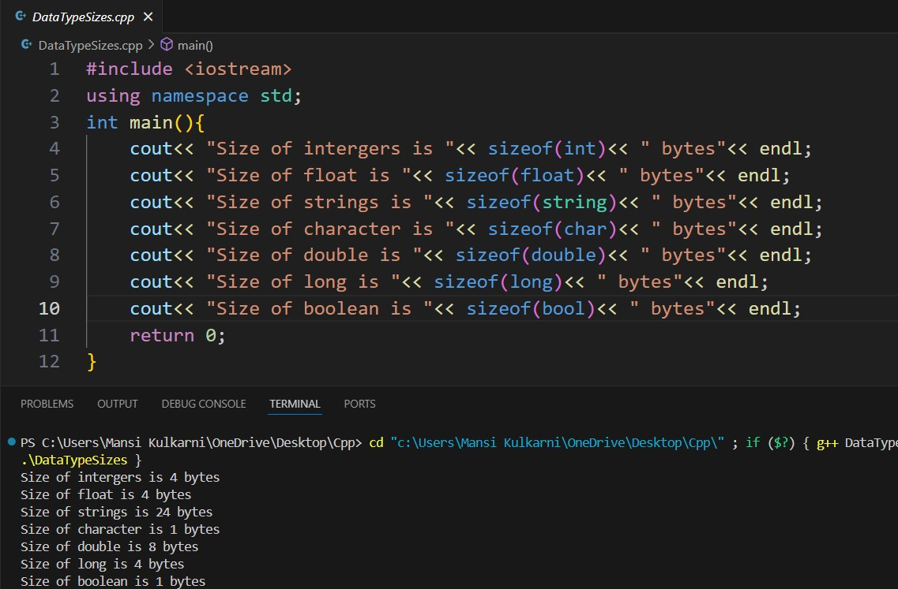
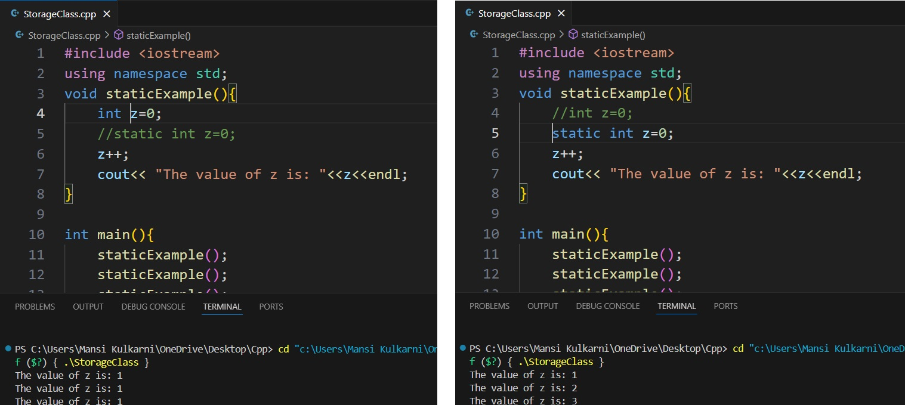

# Experiment 2
## Program 1
### Aim: 
Display the size of each primitive data type. 
### Software used: 
Visual Studio Code
### Theory:
Primitive data types in C++ are the basic types of data that are built into the language. These include:
### 
int: Used to store integers.
###
float: Used to store single-precision floating-point numbers.
###
string: multiple characters 
###
double: Used to store double-precision floating-point numbers.
###
char: Used to store single characters.
###
bool: Used to store boolean values (true or false).
###
The sizeof Operator in C++ is a unary operator that calculates the size of data type, constants, and variables at compile time. 
### Output:

### Conclusion:
We learned what data types are and displayed their sizes. 

## Program 2
### Aim: 
Demonstration of Storage Classes in C++
### Software used: 
Visual Studio Code
### Theory:
Storage classes in C++ define the scope (visibility) and lifetime of variables or functions within a C++ program.
### 
auto: Deduces the type of the variable at compile-time. It is commonly used in modern C++ to let the compiler infer the type.
###
register: Suggests to the compiler to store the variable in a CPU register for faster access, though it's only a suggestion and not a directive.
###
static: Limits the visibility of a variable to the file, function, or block where it is defined, while also preserving its value between function calls.
###
extern: Indicates that the variable or function is defined in another file or later in the same file, facilitating sharing of variables across multiple files.
### Output:

### Conclusion:
We learned what storage classes are and their implementation.
